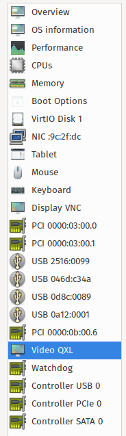
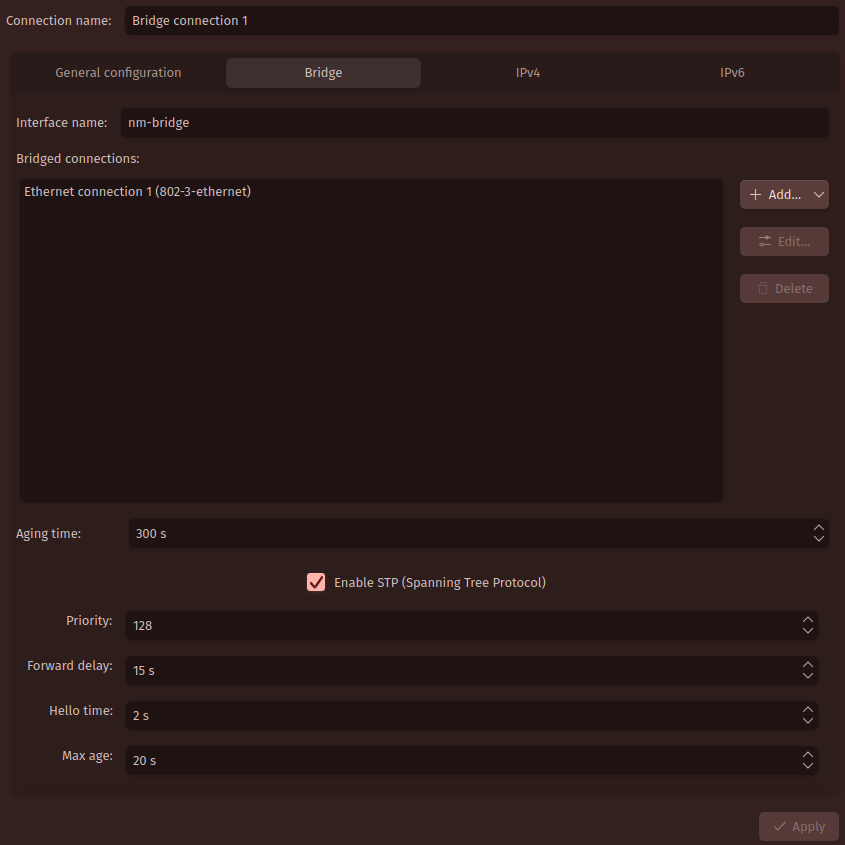

# Hello again!

As the title suggests, I come to you with a small guide to get you started with making your own VM!
It is by no means a complete guide, as it will only cover what I personally had to go through to make
things work, but it should be enough for those that have similar specs for their PC.

## But why?

A while ago I found out that one of the VR games I own got a major update that looked really promising.
Problem was, I am running Linux, and it was not working with [ALVR](https://github.com/alvr-org/ALVR) and Proton...
So, after a relatively long procrastination, I decided to just go for making a VM. Here comes problem number two:
Steam Link! Since I have a Quest 2, I cannot just plug and play, I have to connect somewhere, and a regular VM
with the default network just won't do. The Steam app will not detect it! This is where the bridge networks came
in clutch.

**In short:** I care about my privacy, and I was lazy to dualboot.

Anyways, let's get going!

## The guide.

Like I said at the beginning, this will only cover parts that I personally had to do. **This means there will be
no mention for NVIDIA!** The process is roughly the same, except you will have to [patch your GPU vBIOS](https://github.com/QaidVoid/Complete-Single-GPU-Passthrough?tab=readme-ov-file#vbios-patching).

### Setting up your BIOS and GRUB

First thing on our list is to enable all the virtualization tools. Which means, you have to enable `Intel VT-d` or `AMD-Vi` in your BIOS. _If you don't see these options, your computer likely doesn't support virtualization, making the rest of the steps irrelevant._

Then, we'll need to enable IOMMU. To do that, you'll need to edit `/etc/default/grub` like so:

```sh
# ...
GRUB_CMDLINE_LINUX_DEFAULT='... amd_iommu=on iommu=pt ...'
# ...
```

> For Intel CPUs, type `intel_iommu` instead of `amd_iommu`

And now restart your computer. To check if things worked, use the `dmesg | grep IOMMU` commands (as root). You should see something like this:

```
[    0.324086] pci 0000:00:00.2: AMD-Vi: IOMMU performance counters supported
[    0.381785] perf/amd_iommu: Detected AMD IOMMU #0 (2 banks, 4 counters/bank).
```

### Installing and setting up packages

Great, you have virtualization enabled, and all your internals are ready to go. Time to set up your packages. I use Arch (btw), but the process is very similar on most systems, provided you don't use something like SELinux, which I will not cover in this guide.

<details>
  <summary><b>Arch Linux</b></summary>

```sh
pacman -S qemu libvirt edk2-ovmf virt-manager dnsmasq ebtables
```

</details>

<details>
  <summary><b>Fedora</b></summary>

```sh
dnf install @virtualization
```

</details>

<details>
  <summary><b>Ubuntu</b></summary>

```sh
apt install qemu-kvm qemu-utils libvirt-daemon-system libvirt-clients bridge-utils virt-manager ovmf
```

</details>

After installing these packages, you have to enable some services:

<details>
  <summary><b>systemd</b></summary>

```sh
systemctl enable --now libvirtd
```

</details>

<details>
  <summary><b>OpenRC</b></summary>

```sh
rc-update add libvirtd default
rc-service libvirtd start
```

</details>

You might need to force start your virtual network as well, you can do that by typing

```sh
sudo virsh net-start default
sudo virsh net-autostart default
```

### Setting up the guest OS

We're getting closer, it's time to install Windows. Get yourself a Windows ISO. Your first step is to make a new virtual machine using Virtual Machine Manager. Make sure to check "Customize configuration before install!" This is very important!

In the _Overview_ section, set the VM's chipset to Q35 (likely already the default), and the firmware to UEFI.

Then, go to the _CPUs_ section and set the configuration to host-passthrough (once again, this is likely the default), and set the topology to your liking. I set it to 1 socket, 5 cores and 2 threads for example.

Go to the _SATA Disk 1_ section, and set it to `Virtio`. It will change to "Virtio Disk 1". **Do the same with your _NIC_!**

Download the [virtio-win](https://fedorapeople.org/groups/virt/virtio-win/direct-downloads/stable-virtio/virtio-win.iso) ISO, and attach it as a CDROM device (Add Hardware > Storage > Device Type).

You can now hit "Begin Installation"! Go through the steps just like a normal Windows installation.

### Attaching your devices

After the Windows install is done, delete the `Sound ich*` and `Channel (spice)` devices, we will not need these anymore. Inside the _Display Spice_ section, change the type to VNC server, and set the address to "All interfaces". We will use this to connect to our VM to install the graphics drivers.

Add your GPU and the HDMI Audio PCI devices (Add Hardware > PCI Host Device). You can also add your USB host devices, we will not need them on the host anyways. Add your keyboard and mouse along with any other device you might need. I added my Bluetooth dongle for example. Your list should look something like this:



### Making the hooks

The fun part! To use our GPU for this VM, we have to unload everything that uses the GPU, along with the drivers.

#### Libvirt hook

This is needed for libvirt to recognize our other hooks.

```sh
sudo mkdir /etc/libvirt/hooks
sudo touch /etc/libvirt/hooks/qemu
sudo chmod +x /etc/libvirt/hooks/qemu
```

The contents of `/etc/libvirt/hooks/qemu`:

```sh
#!/bin/bash

GUEST_NAME="$1"
HOOK_NAME="$2"
STATE_NAME="$3"
MISC="${@:4}"

BASEDIR="$(dirname $0)"

HOOKPATH="$BASEDIR/qemu.d/$GUEST_NAME/$HOOK_NAME/$STATE_NAME"
set -e # If a script exits with an error, we should as well.

if [ -f "$HOOKPATH" ]; then
eval \""$HOOKPATH"\" "$@"
elif [ -d "$HOOKPATH" ]; then
while read file; do
  eval \""$file"\" "$@"
done <<< "$(find -L "$HOOKPATH" -maxdepth 1 -type f -executable -print;)"
fi
```

#### The start hook

This is the script that gets executed when you start the VM. **Make sure to replace `win10` with your own VM's name!**

```sh
sudo mkdir --parents /etc/libvirt/hooks/qemu.d/win10/prepare/begin
sudo touch /etc/libvirt/hooks/qemu.d/win10/prepare/begin/start.sh
sudo chmod +x /etc/libvirt/hooks/qemu.d/win10/prepare/begin/start.sh
```

The contents of `/etc/libvirt/hooks/qemu.d/win10/prepare/begin/start.sh`:

```sh
#!/bin/bash
set -x

# Stop KDE Plasma
# Comment this out if you're not using Plasma!
systemctl --user -M michiru@ stop plasma*

# Stop display manager
systemctl stop display-manager

# Unbind VTconsoles: might not be needed
echo 0 > /sys/class/vtconsole/vtcon0/bind
echo 0 > /sys/class/vtconsole/vtcon1/bind

# Unbind EFI Framebuffer
echo efi-framebuffer.0 > /sys/bus/platform/drivers/efi-framebuffer/unbind

# Unload AMD kernel module
modprobe -r amdgpu

# Detach GPU devices from host
# Use your GPU and HDMI Audio PCI host device
# You can check their addresses in virt-manager!
virsh nodedev-detach pci_0000_03_00_0
virsh nodedev-detach pci_0000_03_00_1
virsh nodedev-detach pci_0000_0b_00_6 # My audio controller

# Load vfio module
modprobe vfio-pci
```

#### The release hook

This is the script that gets executed when you stop the VM. **Make sure to replace `win10` with your own VM's name!**

```sh
sudo mkdir --parents /etc/libvirt/hooks/qemu.d/win10/release/end
sudo touch /etc/libvirt/hooks/qemu.d/win10/release/end/stop.sh
sudo chmod +x /etc/libvirt/hooks/qemu.d/win10/release/end/stop.sh
```

The contents of `/etc/libvirt/hooks/qemu.d/win10/release/end/stop.sh`:

```sh
#!/bin/bash
set -x

# Reattach GPU devices to host
# Use your GPU and HDMI Audio PCI host device
# You can check their addresses in virt-manager!
virsh nodedev-reattach pci_0000_03_00_0
virsh nodedev-reattach pci_0000_03_00_1
virsh nodedev-reattach pci_0000_0b_00_6 # My audio controller

# Unload vfio module
modprobe -r vfio-pci

# Load AMD kernel module
modprobe amdgpu

# Rebind framebuffer to host
echo "efi-framebuffer.0" > /sys/bus/platform/drivers/efi-framebuffer/bind

# Bind VTconsoles: might not be needed
echo 1 > /sys/class/vtconsole/vtcon0/bind
echo 1 > /sys/class/vtconsole/vtcon1/bind

# Restart Display Manager
systemctl start display-manager
```

#### Testing the scripts

This is an optional step, but if these scripts don't work you'll either be stuck on a black screen until you reboot or your VM just won't boot. Here's how you test them:

- Enable SSH (`systemctl enable --now sshd`)
- Get a second computer and connect to your host
    - To get your host computer's IP, you can do `ip a`
- `ssh username@youripaddress`
- Execute the start/stop scripts
    - `sudo /etc/libvirt/hooks/qemu.d/win10/release/end/stop.sh`
    - `sudo /etc/libvirt/hooks/qemu.d/win10/prepare/begin/start.sh`

### Audio passthrough

Since we're not going to need the host computer's audio, we can just pass the PCI device through. Search for something like "HD Audio Controller", or if you have a dedicated card for it, add that one. You could also use [Scream](https://wiki.archlinux.org/title/PCI_passthrough_via_OVMF#Passing_audio_from_virtual_machine_to_host_via_Scream), or [PipeWire](https://wiki.archlinux.org/title/PCI_passthrough_via_OVMF#Passing_audio_from_virtual_machine_to_host_via_PipeWire_directly). If you pass it directly, make sure to edit the part marked by "My audio controller". Otherwise, comment it out.

### Virtualization detection

For some reason cards don't like it whenyou run them in a VM. Here's how you get around this. Inside your VM's settings, go to the _Overview_ section, switch to the XML tab, and edit the VM like this:

```xml
<!-- ... -->
<features>
  <!-- ... -->
  <hyperv>
    <!-- ... -->
    <vendor_id state='on' value='anything'/>
    <!-- ... -->
  </hyperv>
  <!-- ... -->
  <kvm>
    <hidden state='on'/>
  </kvm>
  <!-- ... -->
</features>
<!-- ... -->
```

_Hiding the KVM CPU isn't necessary on AMD, but I added it just to be sure._

### Getting the GPU vBIOS

You could just dump it yourself if you know how to, but there are simpler ways, like [just downloading the one you need for your card...](https://www.techpowerup.com/vgabios)

> Make sure to get your card's ROM! Check the brand, the vendor and the model!!

After you got the vBIOS, name it something simple like `gpu.rom`, and move it to a folder where libvirt can see it. I did this:

```sh
sudo mkdir --parents /var/lib/libvirt/vbios
sudo mv /path/to/gpu.rom /var/lib/libvirt/vbios
sudo chown $(id -u):$(id -g) -R /var/lib/libvirt/vbios
sudo chmod 777 -R /var/lib/libvirt/vbios
```

I got a strange error saying it can't find the `gpu.rom` file when it had rwx permissions for everything, so I gave rwx permissions to everything in the folder, alongside the folder itself.

### Giving the vBIOS to your VM

In your VM settings, go to your GPU's sections, the XML tab, and add this section to each one (the GPU and the HDMI audio controller):

```xml
<hostdev mode="subsystem" type="pci" managed="yes">
  <!-- ... -->
  <rom file="/var/lib/libvirt/vbios/gpu.rom"/>
  <!-- ... -->
</hostdev>
```

Of course, change the path in `file="..."` to your path.

### The bridge network

Here's the part I needed to fix Steam Link not working. We need the VM to be on the same network, so we'll need to make a bridge network. You will need NetworkManager for this.

#### Using Plasma's System Settings

Inside System Settings, go to the Network category and then Connections. Click on the `+` sign to add a new connection, and select Bridge under the "Virtual connections" category. You can name the connection anything you want. **Give a name to the interface, this will be used for the VM.** You will have to add an Ethernet connection to the bridged connections. After you added it, hit save. Now, delete your original Wired Ethernet connection. You won't need this anymore, as the bridge connection will handle everything.

**Do not worry if you don't have internet for a while after setting this up. If you did it right, it should take a while, but the new connection will set itself up again.**

#### Using `nmtui`

The process is the same, except it's in the terminal using NetworkManager's built-in TUI tool. The notable difference is in the main menu. To add a connection, you have to go into the "Edit a connection" menu. There are no categories, you just have to select "Bridge".

#### The result



#### Setting the VM's network

Going back to our VM, go to the _NIC_ section, and change the Network source to "Bridge device...". The device name should be automatically filled in, but if it's not, just put in the name you gave to your interface.

### That's it!

You're done! If any issues arise, comment them and I'll do my best to resolve them and edit the post accordingly. Have fun with your new VM!

## Sources

> [TechPowerUp VGA BIOS collection](https://www.techpowerup.com/vgabios)

**GitHub/Gitlab**

> [QaidVoid/Complete-Single-GPU-Passthrough](https://github.com/QaidVoid/Complete-Single-GPU-Passthrough)
>
> [martinopiaggi/Single-GPU-Passthrough-for-Dummies](https://github.com/martinopiaggi/Single-GPU-Passthrough-for-Dummies)
>
> [risingprismtv/single-gpu-passthrough](https://gitlab.com/risingprismtv/single-gpu-passthrough/-/wikis/home)

**YouTube**

> [Coodos - Windows 11 KVM Single GPU Passthrough](https://www.youtube.com/watch?v=53ZO2pKS4i0)
>
> [Abstract programmer - qemu/kvm bridge and NAT networking](https://www.youtube.com/watch?v=DYpaX4BnNlg)